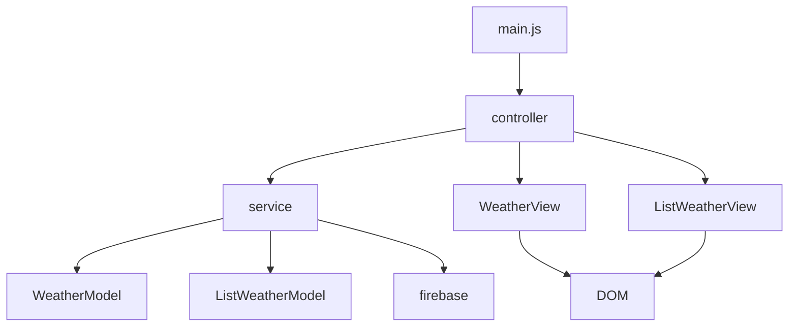

# WeatherDiary

## 개요

### 날씨 저장 기능을 포함한 날씨 어플리케이션

### mvc 패턴 적용

### html5 boilerplate

## 기능 명세

1. 실시간 날씨 받아오는 기능 - OpenWeather API, Geolocation 메서드 사용
2. 날씨 저장 기능 - firebase 사용

## 출처

## html5 boilerplate

https://html5boilerplate.com/

## OpenWeatherAPI

https://openweathermap.org/

## firebase

https://firebase.google.com/firebase

## Geolocation

https://developer.mozilla.org/ko/docs/Web/API/Geolocation_API

## 모듈 의존성 다이어그램(ESM)

Weather : 실시간 & 7일간 날씨 보여주는 화면 ListWeather : 날씨 저장 리스트 보여주는 화면



## 사용법

### 라이브러리 설치

```
npm install
```

### 어플리케이션 실행

```
npm run dev
```

### 유닛 테스트

```
npm test
```

## 설정

### firebase 실행 방법

#### firebase에서 앱 생성 후 sdk 다운로드 받아서 다음과 같이 적용

#### 파일 경로 : root에 apikey.js 생성

```javascript
export const firebaseConfig = {
  apiKey: "",
  authDomain: "",
  projectId: "",
  storageBucket: "",
  messagingSenderId: "",
  appId: "",
  measurementId: ""
};
```

### openweatherAPI

#### openweatherAPI 에서 apikey 다운로드 받아서 apikey.js에 저장

#### 파일 경로 : root에 apikey.js 생성

```javascript
export const weatherAPI = {
  apikey: ""
}
```

